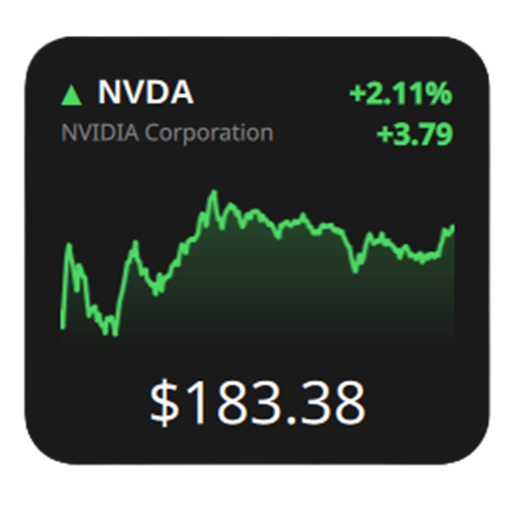

# Stock Monitor — Firefox Add-on

> KDE Plasma widget [`stock-monitor-widget-main`](../stock-monitor-widget-main)'ın Firefox portu. Aynı Yahoo Finance API, aynı fonksiyonlar — tarayıcıda.

<p align="center">
  
</p>

<p align="center">
  <a href="https://addons.mozilla.org/en-US/firefox/"></a>
  
  
</p>

## ✨ Özellikler

| KDE Widget | Firefox Add-on |
|---|---|
| Yahoo Finance v8 chart | ✅ `query1.finance.yahoo.com/v8/finance/chart/{ticker}` |
| Ticker arama (SS / MSL) | ✅ `query2/.../search?q=` |
| Single / Multi-Stock List | ✅ Popup'ta toggle |
| Chart Range 1D…Max | ✅ 1D/5D/1M/6M/YTD/1Y/5Y/Max (interval map birebir) |
| Refresh 1–360 dk + Battery Saver | ✅ `browser.alarms` + weekend/market-hours |
| Gradient chart + prevClose çizgisi | ✅ Canvas portu |
| Renkler + Light/Dark | ✅ Özelleştirilebilir |
| Portfolio (WIP) | ✅ shares + avgCost + CSV |
| Toolbar badge | ✅ 3 karakter (`2.5`), renk yeşil/kırmızı, tooltip tam değer |
| Tıklama | ✅ Sol: Yahoo, Orta: Yenile |

## 📸 Ekran Görüntüleri

> *Yakında eklenecek — popup, options ve badge örnekleri*

`screenshots/` klasörüne ekle:
- `popup.png` — single/multi view
- `options.png` — ayarlar sekmeleri
- `badge.png` — toolbar rozeti

## 🚀 Kurulum

### Geçici (test)
1. `about:debugging` → This Firefox → Load Temporary Add-on
2. `manifest.json` seç

### Kalıcı
- `web-ext-artifacts/stock_monitor-2.2.zip` → `about:addons` → Install from file
- yakında AMO (unlisted) üzerinden de indirilebilir olacak

## ⚙️ Ayarlar

`Ayarlar →` 5 sekme (KDE ile aynı):

- **General** — Single/Multi, ticker listesi, sort, swap, range, interval, market hours
- **Search** — Yahoo arama + SS/MSL
- **Panel** — Rozet gizle
- **Portfolio** — Add/Update/Remove + CSV
- **Appearance** — Light theme, renkler, opacity
- **Backup** — Export/Import JSON (tüm ayarlar), Portfolio CSV

## 🔍 Sembol Örnekleri

`finance.yahoo.com`'daki kodun aynısı:

- US: `AAPL`, `TSLA`, `MSFT`
- Crypto: `BTC-USD`, `ETH-USD`
- Index: `^GSPC`, `^NSEI`
- FX: `INR=X`, `EURUSD=X`
- BIST: `THYAO.IS`, `GARAN.IS`, `XU100.IS`

## 🛠️ Geliştirme

```bash
npm i -g web-ext
web-ext run --source-dir .        # canlı test
web-ext lint --source-dir .       # doğrulama (0 error)
web-ext build --source-dir .      # zip üret
web-ext sign --channel=unlisted   # AMO unlisted (WEB_EXT_API_KEY/SECRET gerekir)
```

## 📦 Yapı

```
stock-monitor-ff/
├── manifest.json
├── background.js      # fetch, alarm, badge
├── icons/icon.png
├── utils/             # storage + format helpers
├── popup/             # Single/Multi + canvas chart
├── options/           # 6 sekme (General/Search/Panel/Portfolio/Appearance/Backup)
└── README.md
```

## 📄 Lisans

GPL-3.0+ — widget ile aynı. Orijinal: [vpsone/stock-monitor-widget](https://github.com/vpsone/stock-monitor-widget)

---

Made with ❤️ by [cenktekin](https://github.com/cenktekin) — PR'lar ve ekran görüntüleri beklenir!
